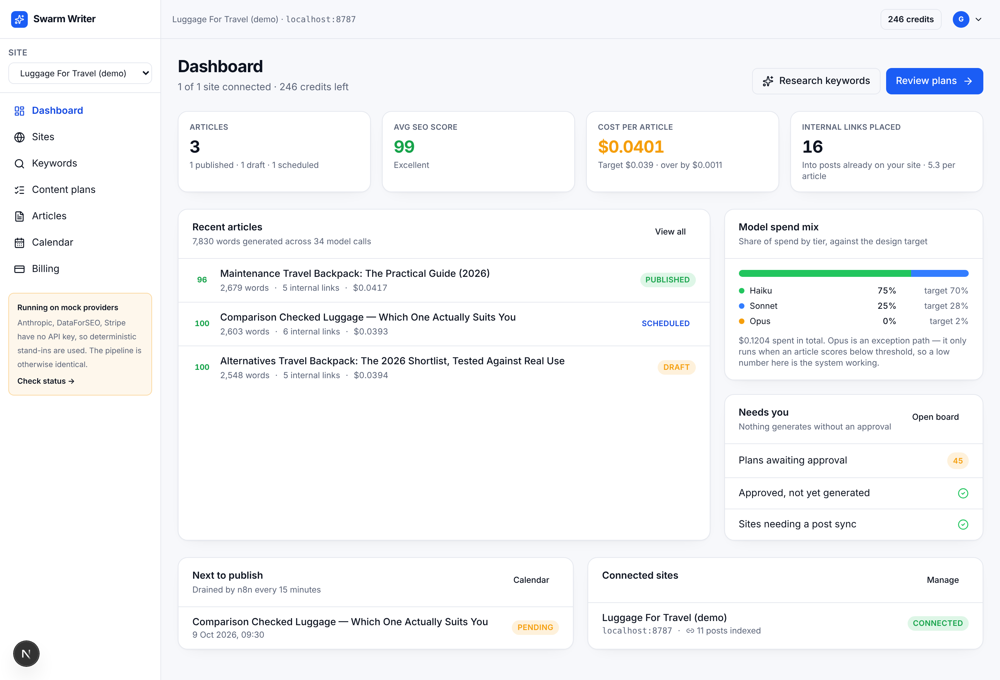
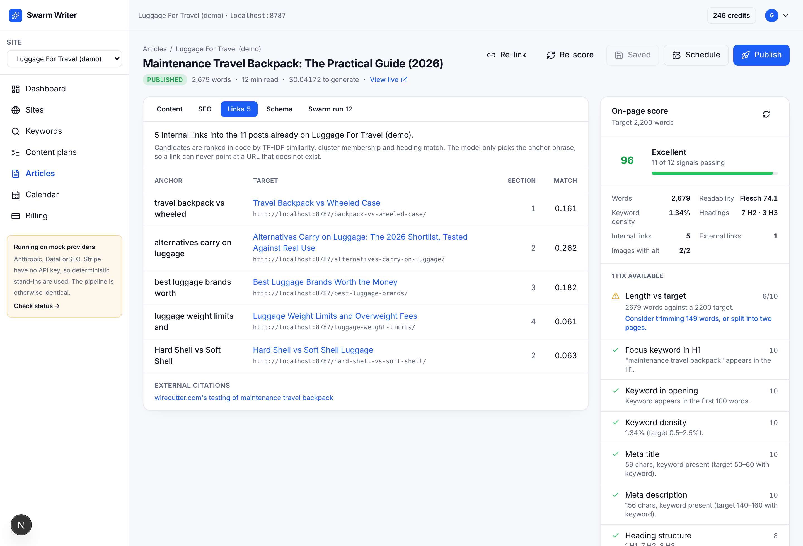

# Swarm Writer

Automated SEO content for WordPress. Connect a site, research keywords, approve a
content plan, and Swarm Writer drafts, scores, links and publishes articles on a
schedule — with RankMath fields filled in and internal links pointing at the posts
already on your domain.

Built on the **GMK Swarm** architecture: a pipeline of narrow, cheap agents behind a
planner, rather than one expensive generalist call.

---

## Run it in two minutes

```bash
npm install
npm run db:migrate     # creates the schema
npm run mock:wp        # terminal 2 — a stand-in WordPress with 8 existing posts
npm run db:seed        # demo workspace: site, 90 keywords, 25 clusters, 48 plans
npm run dev            # terminal 1
```

Open **http://localhost:3000** and sign in:

| | |
|---|---|
| Email | `demo@gmkmedia.co.uk` |
| Password | `swarmwriter` |

**No API keys are needed.** Every integration has a deterministic mock twin, and the
database is an embedded Postgres written to `./.pgdata`. The pipeline you exercise
locally is the same code path that runs in production — only the provider at the edge
changes. `/api/health` reports which mode each one is in.

### Prove it end to end

```bash
npm test     # 93 unit checks: scoring, linking, clustering, crypto, cost maths
npm run e2e  # 87 checks: keyword research → published post with RankMath fields
npm run smoke # 75 checks: the same journey over HTTP against a running dev server
```

`npm run e2e` is the one that matters. It runs the full product path against the
embedded database and the mock WordPress, then reads the published post back off
WordPress to confirm the RankMath meta actually landed.

---

## What it looks like


*Measured cost per article against target, spend mix by model tier, and what is waiting on you.*


*Every internal link points at a post that already exists on the site, with the match score that chose it.*

More screens in [`screenshots/`](screenshots/): the connection wizard, keyword clusters,
the plan approval board, the SEO panel, per-stage cost telemetry and the publishing
calendar.

---

## What it does

1. **Connect** a WordPress site with an application password. Verified on save,
   encrypted with AES-256-GCM at rest. The wizard checks whether RankMath exposes its
   meta over REST and warns you if not.
2. **Index** every published post on the site. This is the asset the internal linking
   runs against.
3. **Research** keywords through DataForSEO — volume, CPC, difficulty, intent, plus SERP
   snapshots of the best terms.
4. **Cluster** them into topics with a nominated pillar keyword. Runs in code, so it is
   instant and free.
5. **Plan** — each cluster becomes briefs with titles, angles, word targets and outlines.
   Plans are drafts until a human approves them; no credit is spent before that.
6. **Generate** with the 7-stage swarm (below).
7. **Score** against 12 weighted on-page signals, each deduction carrying a specific fix.
8. **Publish** now or on a calendar, with RankMath meta and JSON-LD.

---

## The generation swarm

| # | Stage | Tier | Why |
|---|---|---|---|
| 1 | `research` | Haiku | Summarising supplied SERP text |
| 2 | `outline` | **Sonnet** | Structure decides the article; never downgraded |
| 3 | `draft` | Haiku | One call per section, run in parallel |
| 4 | `facts` | Haiku | Pattern-matching claims against the brief |
| 5 | `seo` | Haiku | Rule-driven metadata |
| 6 | `links` | Haiku | Choosing an anchor from a code-computed shortlist |
| 7 | `polish` | Sonnet → Haiku | Downgraded automatically if the run would overspend |
| — | `escalate` | Opus | Only when the score lands below threshold |

**Cost is measured, not estimated.** Token counts come back off every call and land in
`article_runs`, so the figure on your dashboard is auditable. A `TierRouter` prices each
upgradeable stage before committing to it and drops to Haiku rather than exceed the
`$0.039` target.

Measured on the demo workspace: **$0.0385 per 2,500-word article**, 75% / 25% / 0%
Haiku / Sonnet / Opus by spend, 100/100 on-page.

---

## Where this beats SEOBOT

| | SEOBOT | Swarm Writer |
|---|---|---|
| Internal linking | Links its own generated posts | Ranks candidates from **your live site's** posts with TF-IDF, then lets the model pick only the anchor — so a hallucinated URL is structurally impossible |
| Cost | Opaque, bundled | Measured per article and shown per stage |
| Quality | Single pass | 7 stages with a fact pass, a score gate and an Opus escalation path |
| SEO fields | Generic | RankMath post meta written natively over REST |
| Billing | Subscription seats | Credits — 1 credit = 1 article, no expiry |

---

## Going live

Fill in `.env.local` (copy `.env.example`); each key swaps a mock for the real thing,
independently.

| Key | Effect when set |
|---|---|
| `DATABASE_URL` | Neon Postgres instead of the embedded database |
| `ANTHROPIC_API_KEY` | Real generation |
| `DATAFORSEO_LOGIN` / `_PASSWORD` | Real keyword and SERP data |
| `STRIPE_SECRET_KEY` | Real checkout; the local test-purchase route switches itself off |
| `CRON_SECRET` | Authenticates the n8n endpoints |
| `AUTH_SECRET` | **Required in production.** Rotating it invalidates stored WP credentials by design |
| `WORDPRESS_DRY_RUN=true` | Records the exact publish payload without writing to the site |

Deploy on Vercel. Import `n8n/swarm-writer-workflows.json` into
`gmkmedia.app.n8n.cloud` and set the two n8n variables it names — a 15-minute publisher
and a weekly keyword refresh.

---

## Layout

```
src/
  app/            pages and /api route handlers
  lib/
    db/           schema.sql + one sql() over Neon, pg or embedded Postgres
    providers/    dataforseo · anthropic · wordpress · stripe, each with a mock twin
    services/     keywords · clustering · plans · articles · swarm/* · seo-score
                  internal-links · schema-gen · publish · credits
    auth/         sessions, scrypt passwords, AES-256-GCM for WP credentials
  components/     ui primitives + app screens
scripts/          migrate · seed · mock-wp-server · e2e-pipeline · smoke · test-runner
n8n/              importable workflow definitions
docs/             ARCHITECTURE.md · RUNBOOK.md
```

Route handlers never call providers; services never call `fetch`. Everything crossing
the process boundary goes through `src/lib/providers/*` — which is what makes the app
runnable with no accounts and testable with no network.

Full design rationale: [`docs/ARCHITECTURE.md`](docs/ARCHITECTURE.md).
Operations and troubleshooting: [`docs/RUNBOOK.md`](docs/RUNBOOK.md).
